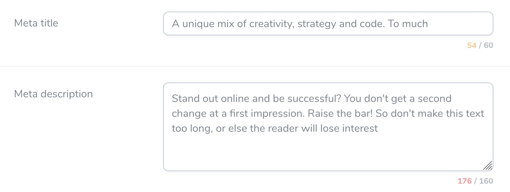

# Nova Charcounter Fields

Text and textarea fields with a character counter for Laravel Nova.

### Background

This package is fork from the source `elevate-digital/nova-charcounted-fields` which was deleted from Github. We will try to maintain the compatibility with future releases of Laravel Nova.

### Installation

You can require this package using composer:

`composer require escuelademusica/nova-charcounted-fields`

# Usage

You can add the field with a resolver as follows:

```
use EscuelaDeMusica\CharcountedFields\TextCounted;
use EscuelaDeMusica\CharcountedFields\TextareaCounted;

TextCounted::make('Meta title')
```


You can use the text and textarea fields with charactercounters on you Nova model. The max number of characters aren't enforced, but just encouraged with warning colors and the counter. (You could enforce the max number of characters with Nova's built in _rules_ and with a _maxlength_ extra attribute).

```php
TextCounted::make('Meta title')
    ->maxChars(60)
    ->warningAt(50)
    ->withMeta(['extraAttributes' => ['maxlength' => '65']]),

TextareaCounted::make('Meta description')
    ->maxChars(160)
    ->warningAt(150)
    ->rows(3),
```

The maxChars and warningAt are both optional. The color of the counter will change when the max or warningAt limit is reached.

